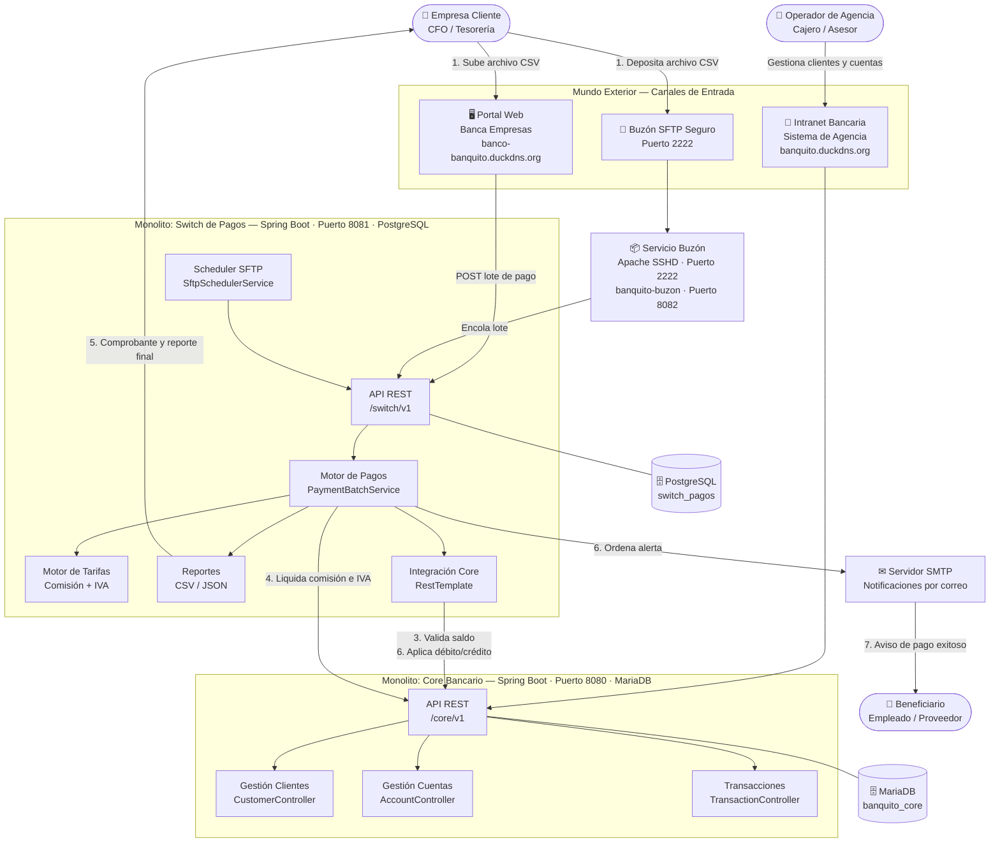
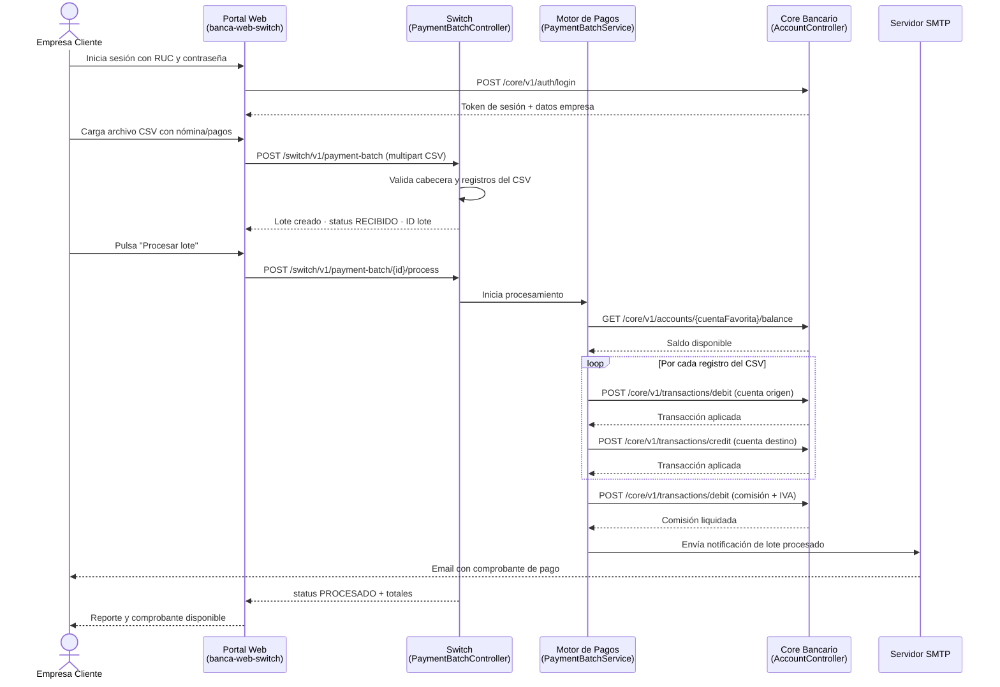
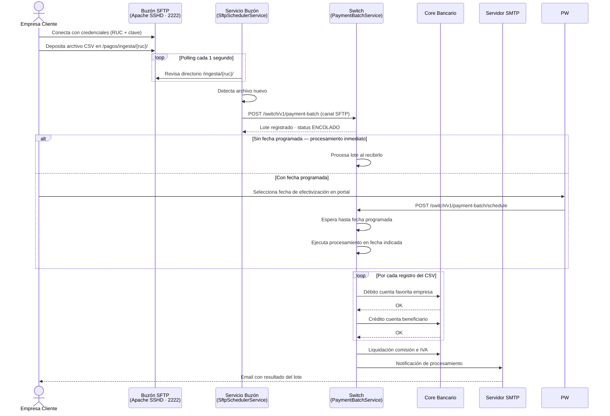
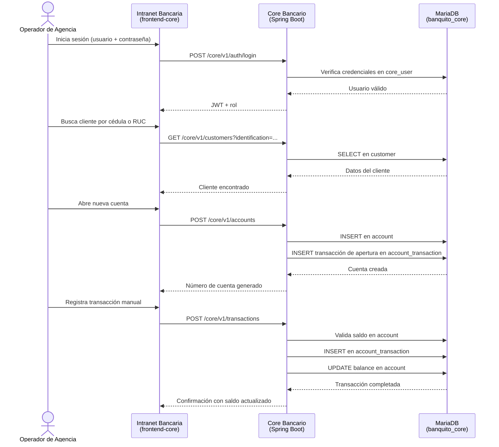
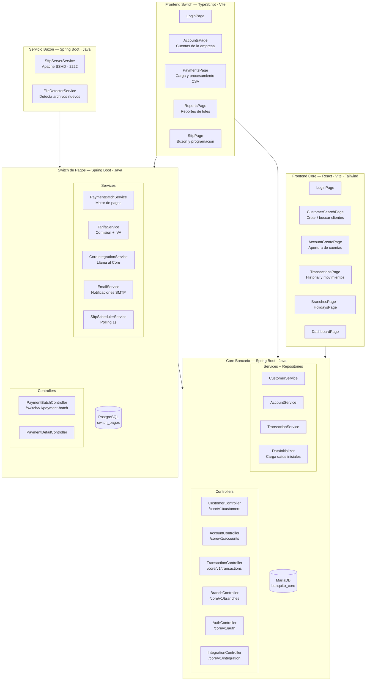
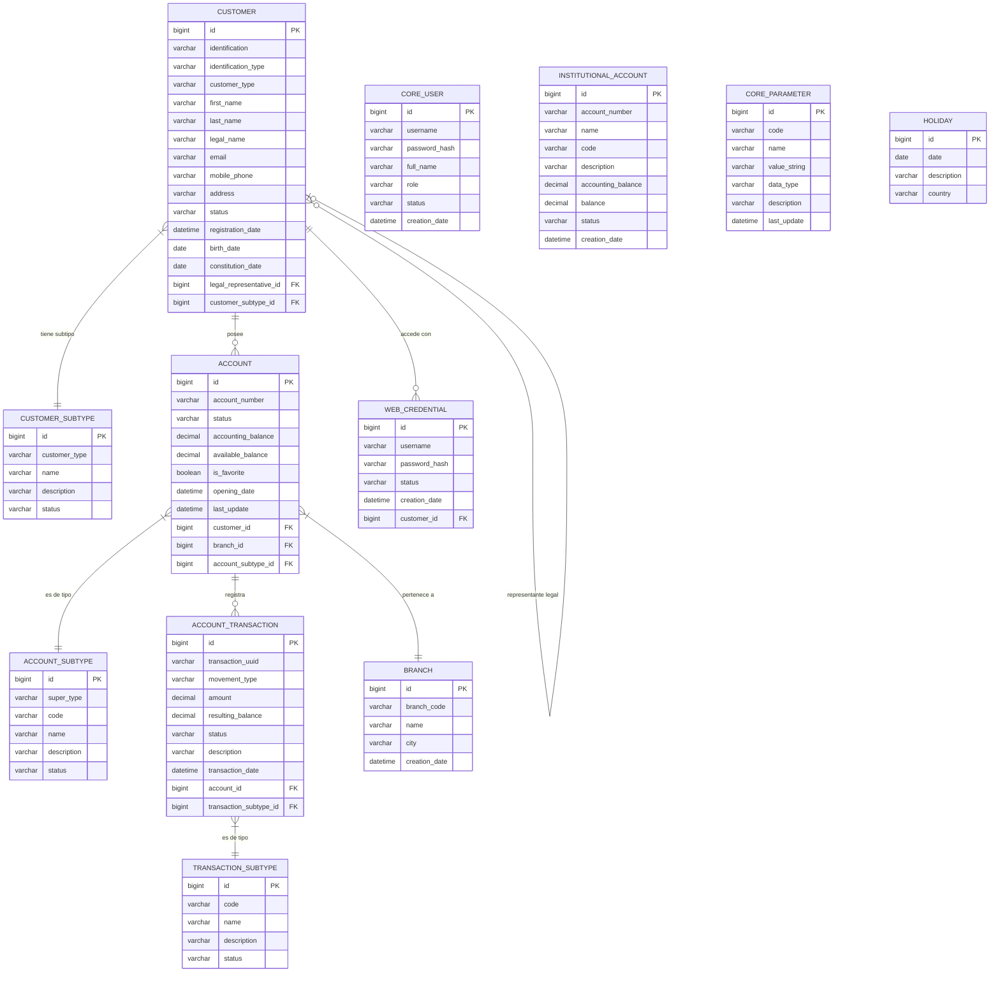
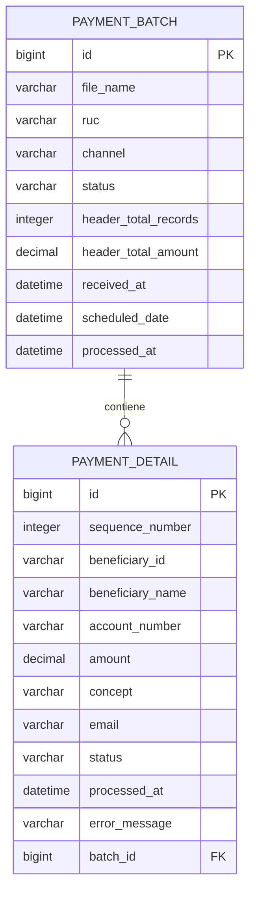

# BancoBanQuito — Arquitectura del Sistema

---

## 1. Diagrama de Arquitectura General

---

## 2. Diagrama de Secuencia — Canal Portal Web

---

## 3. Diagrama de Secuencia — Canal SFTP

---

## 4. Diagrama de Secuencia — Intranet Bancaria (Core)

---

## 5. Componentes Lógicos

---

## 6. Base de Datos — MariaDB (Core Bancario)

---

## 7. Base de Datos — PostgreSQL (Switch de Pagos)

---

*BancoBanQuito — Grupo 1 | Arquitectura de Software | 2026*
